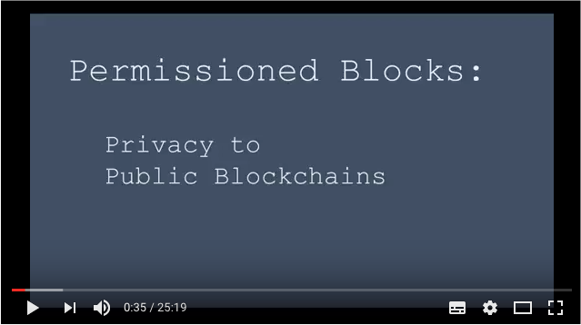

# Permissioned Blocks - Bringing Privacy to Public Blockchains

The white paper (still in progress) that details the engineering design decisions behind the prototype shown in the following demo video:

[White Paper - Permissioned Blocks](https://github.com/autocontracts/permissioned-blocks/blob/master/whitepaper.md) 

[](https://www.youtube.com/watch?v=Zt9DIopmzbA)
<br>

Demo Highlights:

- 100% privacy of smart contract functional state information.
- Max throughput of 10,000 transactions per second (using [Tendermint](https://tendermint.com/) consensus engine).
- No gas processing fees.
- Decentralised solution using a folk of [IPFS](https://ipfs.io/) for the secure storage of smart contract state information.
- Compatible with any Turing Complete blockchain (e.g. [Ethereum](https://www.ethereum.org/), [Hyperledger](https://www.hyperledger.org/)). Decoupled and modular design.
- Multi user/role security model capabilities.  

## Run Demo

A docker image has been created as the easiest way to run the permissioned blocks demo, with all the environment settings setup for you. For instructions for install Docker see [here](https://docs.docker.com/engine/installation/). 

Run the following command:
```
$ docker run --name device-1 -p 3001:3001 -p 4001:4001 -e LOCALHOST="0.0.0.0:3001" -e IPFS_SWARMHOST="/ip4/0.0.0.0/tcp/4001" autocontracts/permissionedblocks 
```

This will host the contract-manager on port 3001, and IPFS on port 4001.
Make sure that you do not have a firewall blocking these ports and they are open.

To clean up:
```
$ docker stop device-1
$ docker rm device-1
```

If you want to create another docker container running on the same machine, then:
```
$ docker run --name device-2 -p 3002:3002 -p 4002:4002 -e LOCALHOST="0.0.0.0:3002" -e IPFS_SWARMHOST="/ip4/0.0.0.0/tcp/4002" autocontracts/permissionedblocks 
```

To clean up:
```
$ docker stop device-2
$ docker rm device-2
```

At the moment, the demo is uses LinkedIn in order to identify yourself, and register your deivce. So, you'll have to create a dummy account in order to test using the second device. Other login options will be added later...